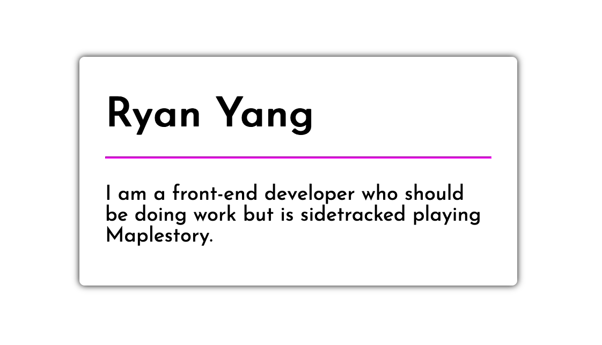
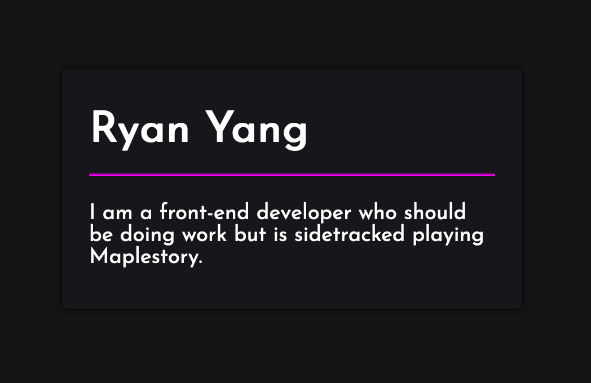

# Making a dark / light mode theme switcher

*Note: This is not a complete guide on dark mode, but rather a quickstart for new developers to get a theme setup up and running in a small codebase. For a more in-depth analysis regarding dark modes, you can check out [this](https://ryanfeigenbaum.com/dark-mode/) amazing article  written by Ryan Feigenbaum.*


For people who have used their phones/computer in the dark, dark mode is one of the most coveted features around. Before we dive into how we can create a dark mode and toggle it, let's first take a look at what dark mode is. Dark mode is a design concept that utilizes light colors (usually white or pastel-like colors) for text and icons contrasted with a dark background, as opposed to dark colored text on a light background (like a book or print newspaper). 

## Why have a dark mode?

Aside from dark mode looking cooler than light mode (personal and subjective preference, of course), dark mode can reduce eyestrain in low-light conditions. Have you ever surfed the web on your phone at night and you visit a page that blinds you with white light? Adding a dark mode to your site will require more work - you have to now create 2+ sets of CSS styles - and is not strictly necessary but man, is it cool.


## Implementing dark mode

After we've inevitably decided to add dark mode to our site. Let's go ahead and implement it

#### Starting code
Imagine we have the following website without dark mode:

```file
└── making-a-theme-switcher
    ├── index.html
    ├── styles.css
    └── script.js
```

```html index.html
<!DOCTYPE html>
<html>
  <head>
    <title>Dark Theme Switcher</title>
    <link href="https://fonts.googleapis.com/css2?family=Josefin+Sans&display=swap" rel="stylesheet"> 
    <link rel="stylesheet" type="text/css" href="./style.css" />
    <script src="./script.js"></script>
  </head>
  <body>
    <div class="card">
      <h1>Ryan Yang</h1>
      <hr />
      <p>
        I am a front-end developer who should be doing 
        work but is sidetracked playing Maplestory
      </p>
    </div>
  </body>
</html>
```

And we style it like this (light mode):

```css style.css
* {
    margin: 0;
}

body {
    display: grid;
    height: 100vh;
    width: 100vw;
    font-family: 'Josefin Sans', sans-serif;

    /* here are the styles below we want to 'toggle' later */
    background-color: white;
    color: black;
}

hr {
    margin: 15px 0px 20px;
    color: #f0f;
}

.card {
    place-self: center;
    max-width: 300px;
    padding: 30px 20px;
    border-radius: 4px;
    box-shadow: 0 0 5px black;

    /* here are the styles below we want to 'toggle' later */
    background-color: white;
}
```

```javascript script.js
// our javascript is empty.... for now!
```
When we test this code in the browser, we get something that looks like this:



#### Dark mode styles

In this simple example, to convert our design into dark mode, we only need to swap a couple CSS styles. More specifically, we will be toggling the `background-color` and `color` properties only. Below are the values we will be swapping to. (This `/* ... */` denotes that the content that belongs there in the original are left unchanged)

```css style.css
/* ... */
body {
    /* ... */
    background-color: #151515;
    color: white;
}
/* ... */
.card {
    /* ... */
    background-color: #15171A;
}
```
Swapping these styles will result in something that looks like this:




## CSS Variables

There are a couple ways to implement a dark mode but the way I'll be showing you is with CSS variables. So, how does it work?

[CSS variables](https://developer.mozilla.org/en-US/docs/Web/CSS/Using_CSS_custom_properties) are essentially placeholders for values and you can update them with Javascript. They operate like variables in Javascript or any other programming language and when they get changed, the webpage will immediately respond and apply the new CSS styles, rerendering the webpage.

## Applying CSS variables to our code

Since there are 3 things we want to toggle, we will only use 3 variables.


| Elements that will change styles | Light Mode (color/hex code) | Dark Mode (color/hex code) |
|----------------------------------|-----------------------------|----------------------------|
| Background color of page         | white / #FFFFFF             | *dark grey / #151515       |
| Background color of card item    | white / #FFFFFF             | *dark blue-grey / #15171A  |
| Color of text                    | black / #000000             | white / #FFFFFF            |

\* - description of color, not actual CSS value


#### Declaring CSS Variables

First, we need to initialize the variables and give them a default value. We can define global variables in something called the root, which is a top-level CSS selector, denoted below:

```css style.css
:root {
    --background: white;
    --card-background: white;
    --text-color: black;
}
/* ... */
```

Ok. What the *heck* did we just do? Well, the general CSS syntax is still the same where we have our selector and a bunch of `property:value`'s for the selector. Our selector is `:root`, which is a level above `html` and so that allows us to use these variables from anywhere in our CSS code.

What might not be familiar, however, are the properties for the selector. The `--` in front of the property let's our CSS know that we are declaring values for a CSS variable, not a CSS style. Everything after the `--` and before the `:` is our variable name. CSS variables are case sensitive and we use a single dash, `-`, if our variable name has multiple words. 

#### Using CSS Variables

Now that we initialized the CSS variables in our `:root`, we can use them where we need. Our CSS page will eventually look something like this:

```css style.css
/* ... */
body {
    /* ... */
    background-color: var(--background);
    color: var(--text-color);
}
/* ... */
.card {
    /* ... */
    background-color: var(--card-background);
}
```

Notice, we simply replaced the value of the CSS style with the variable name. We use `var()` to let CSS know that the value we are applying is going to be a CSS variable, rather than an actual, hardcoded value.

#### Dynamically changing our CSS Variable

Great! Once we have our CSS Variables set up, we can go ahead and dynamically change the values of our CSS properties whenever we want. How do we do that? Take a look at this Javascript code:

```javascript script.js
function changeToDarkMode(){
    document.documentElement.style.setProperty('--background', "#151515");
    document.documentElement.style.setProperty('--card-background', "#15171A");
    document.documentElement.style.setProperty('--text-color', "white");
}
```

The code above simply creates a function named `changeToDarkMode` and will target the `:root` styles (with `document.documentElement.style`) and individually set every variable to it's new value.

We can attach this function to, say, a button and when we click on it, it will toggle dark mode for our webpage.